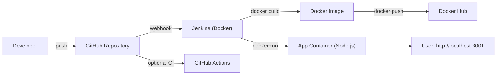

# CI/CD Pipeline Project (Jenkins + Docker + GitHub)

[](https://github.com/shivamrajput726/cicd-pipeline-project/actions/workflows/ci.yml)


A recruiter-friendly DevOps project that demonstrates a **webhook-triggered Jenkins CI/CD pipeline** for a **containerized Node.js app**.

What it does:
- On every push to GitHub, Jenkins is triggered via webhook.
- Jenkins builds a Docker image, tags it as `latest` and `<BUILD_NUMBER>`, pushes to Docker Hub, and deploys the container locally.
- An optional GitHub Actions workflow runs lightweight CI checks (tests + Docker build sanity).

## Architecture (diagram)



## CI/CD workflow (Jenkins)

Pipeline file: `Jenkinsfile`

Stages:
1. **Pull code from GitHub**: checkout the latest code
2. **Validate configuration**: fail fast if Docker Hub repo is not set
3. **Unit tests (optional)**: run `npm ci` + `npm test` inside a Node.js Docker container
4. **Build Docker image**: build and tag image as `latest` and `${BUILD_NUMBER}`
5. **Push image to Docker Hub (optional)**: push both tags using Jenkins credentials
6. **Run container (optional)**: deploy the new image locally on port `3001`

## Repository structure

```
.
|-- app/
|   |-- src/
|   |   |-- app.js
|   |   `-- server.js
|   |-- test/
|   |   `-- health.test.js
|   |-- .env.example
|   |-- package.json
|   `-- package-lock.json
|-- docs/
|   `-- screenshots/
|       `-- .gitkeep
|-- jenkins/
|   `-- Dockerfile
|-- .github/
|   |-- workflows/
|   |   `-- ci.yml
|   |-- ISSUE_TEMPLATE/
|   |   `-- bug_report.md
|   `-- pull_request_template.md
|-- Dockerfile
|-- Jenkinsfile
|-- docker-compose.yml
|-- LICENSE
`-- README.md
```

## Prerequisites

- Docker Desktop (or Docker Engine) + Docker Compose
- A Docker Hub account (for pushing images)
- GitHub repository (this repo)

## Setup (Jenkins in Docker)

### 1) Start Jenkins

From the repo root:

```bash
docker compose up -d --build
```

Open Jenkins:
- http://localhost:8080

Get the initial admin password:

```bash
docker exec -it jenkins cat /var/jenkins_home/secrets/initialAdminPassword
```

Install **Suggested plugins** and create an admin user.

> Learning note: this setup mounts the host Docker socket into Jenkins so Jenkins can run Docker commands. This is common for demos but not recommended for hardened production.

### Windows note (Docker socket)

If the Docker socket mount does not work on Windows, set:

```powershell
setx DOCKER_SOCK //./pipe/docker_engine
```

Then open a new terminal and run `docker compose up -d --build` again.

## Jenkins configuration (one-time)

### 1) Install/verify Jenkins plugins

In Jenkins: **Manage Jenkins** -> **Plugins**, ensure these exist:
- Git plugin
- GitHub plugin
- Pipeline
- Credentials Binding

### 2) Add Docker Hub credentials in Jenkins

Jenkins: **Manage Jenkins** -> **Credentials** -> (System) -> **Global** -> **Add Credentials**
- Kind: **Username with password**
- Username: your Docker Hub username
- Password: Docker Hub access token (recommended)
- ID: `dockerhub-creds` (must match `Jenkinsfile`)

### 3) Create the Pipeline job

1. **New Item** -> **Pipeline**
2. Pipeline -> **Definition**: *Pipeline script from SCM*
3. SCM: *Git*
4. Repository URL: your GitHub repo URL
5. Branch specifier: `*/main`
6. Script Path: `Jenkinsfile`

Save -> **Build with Parameters**
- Set `DOCKERHUB_REPO` to something like: `yourdockerhubusername/sample-cicd-app`

## GitHub webhook (auto-trigger Jenkins on push)

GitHub must be able to reach your Jenkins URL. If Jenkins is local, expose it using ngrok.

### Option A: Jenkins on a public server

Webhook URL:
```
https://YOUR_PUBLIC_JENKINS_URL/github-webhook/
```

### Option B: Jenkins local + ngrok (beginner-friendly)

1. Start ngrok:
   ```bash
   ngrok http 8080
   ```
2. Copy the HTTPS forwarding URL (example: `https://xxxx.ngrok-free.app`)
3. Jenkins -> **Manage Jenkins** -> **System** -> **Jenkins Location**
   - Jenkins URL: `https://xxxx.ngrok-free.app/`
4. GitHub repo -> **Settings** -> **Webhooks** -> **Add webhook**
   - Payload URL: `https://xxxx.ngrok-free.app/github-webhook/`
   - Content type: `application/json`
   - Events: **Just the push event**
   - Active: enabled

To verify: open the webhook -> **Recent Deliveries** -> expect `200`.

## Run the app (verification)

After a successful Jenkins pipeline run, the app is available at:
- http://localhost:3001/
- http://localhost:3001/health

Check containers:
```bash
docker ps
```

## Optional CI (GitHub Actions)

Workflow: `.github/workflows/ci.yml`

It runs on every push/PR to `main`:
- `npm ci` + `npm test`
- `docker build` sanity check

## Screenshots (placeholders)

Add images to `docs/screenshots/` and link them here:
- `docs/screenshots/jenkins-pipeline.png`
- `docs/screenshots/jenkins-console.png`
- `docs/screenshots/github-webhook.png`
- `docs/screenshots/dockerhub-tags.png`

## Production-like improvements (recommended next steps)

Security:
- Avoid Docker socket mounting; use a dedicated build agent or Kubernetes-based Jenkins agents
- Run Jenkins as non-root and lock down credentials (least privilege)
- Add image scanning (Trivy/Grype) and dependency scanning (npm audit / SCA)

Reliability & scalability:
- Add a staging environment and approval-based promotion to production
- Deploy to Kubernetes (Helm) or a VM using Ansible
- Add centralized logging (Winston + JSON logs) and monitoring (Prometheus/Grafana)

Delivery quality:
- Add linting + formatting (ESLint/Prettier), and expand tests
- Use semantic versioning and release notes

## License

MIT. See `LICENSE`.

